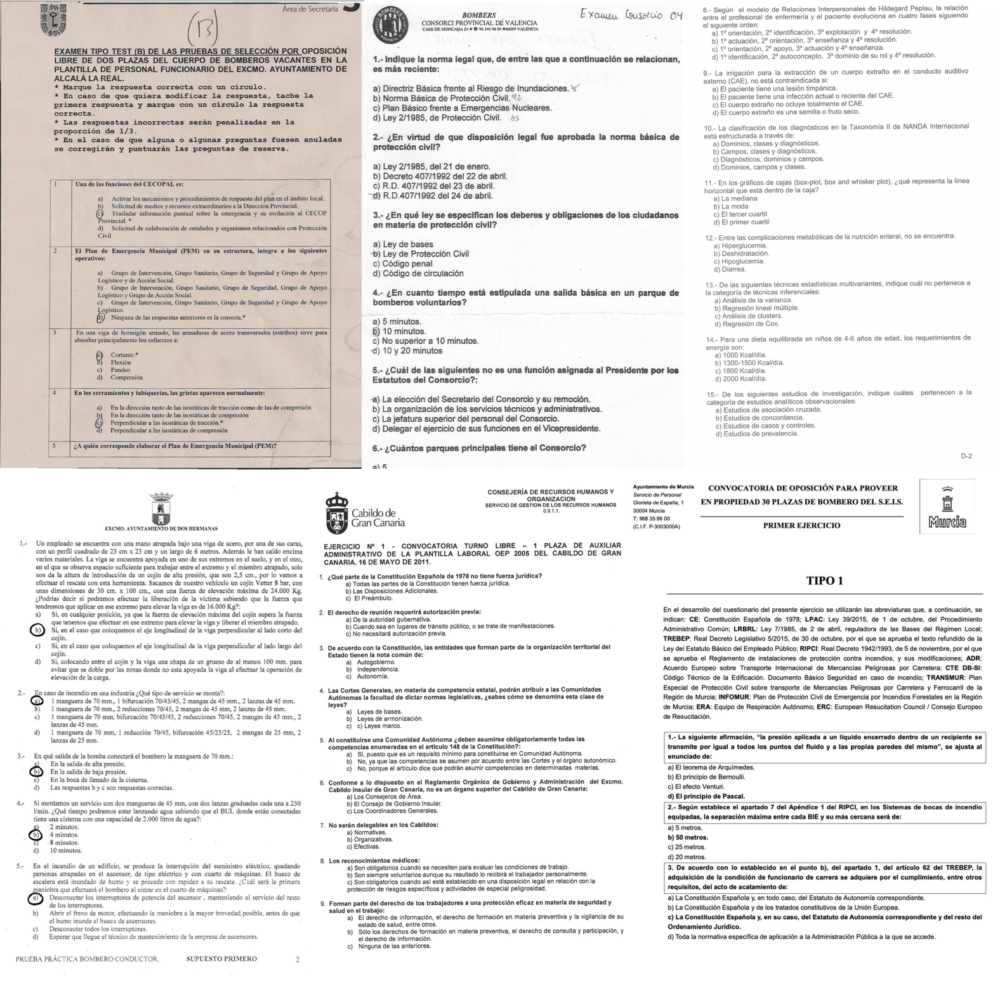

# file2quiz


**file2quiz** is a text processing utility to extract multiple-choice questions from unstructured sources, among other things.

**Functions:**

- **file2text:** Extract text information from a variety of file formats such as JPEG, PNG, PDFs, DOCX, HTML, etc.
- **fil2quiz, text2quiz:** Parse multiple-choice tests from unstructured sources into an structured json file.
- **quiz2text, quiz2anki:** Export json tests into a given format (text, Anki,...)

**Formats supported:**
```
".txt", ".rtf". ".doc", ".docx", ".pdf", ".html", ".htm", ".epub"`
".jpg", ".jpeg", ".jfif", ".png", ".tiff", ".bmp", ".pnm",...
```

**Input examples:**




## Requirements

- [Python 3.7+](https://www.python.org/downloads/)


### Enabling OCR functionality

To enable the Optical Character Recognition of images and PDFs,
you need to install: 

On Ubuntu/Debian:

```
sudo apt install imagemagick
sudo apt install tesseract-ocr
sudo apt install unpaper
```

On MacOS:

```
brew install imagemagick
brew install tesseract
brew install unpaper
```

### Bold text extraction

It's pretty common that multiple-choice question tests mark the correct answer in bold
instead of using a simple table. Therefore, if we extract the bold fragments, we can use them
to perform a similarity matching with the answers from our parsed test to find the correct solution.

Currently, we can extract bold information from HTML and Word (*.docx) documents.


#### Extracting bold text from an HTML document

To enable the extraction of bold text from an HTML document, 
you need to install [ChromeDriver](https://chromedriver.chromium.org/). 
We use it along with Selenium to render the document since the
font-weight is nowadays, usually set through CSS instead of the deprecated bold tag `<b>`.
 
Moreover, if we were to use only these tags, that would mean to miss many bold fragments.


#### Extracting bold text from an Word document

To enable the extraction of bold text from an Word document,
you need to install Word on a Windows machine in addiction to the 
`pywin32` python package.

```
pip install pywin32
``` 


## Installation

Open the terminal, go to the folder of this package and type:

On Ubuntu/Debian/MacOS:

```
python3 setup.py install --user
```

On Windows:

```
py setup.py install --user
```


## Usage

To run these examples, go to the `examples/` folder from the source.


### Parsing multiple-choice tests

To parse a multiple-choice test (or all the tests in a directory), type:

```
# Option 1: (all supported formats)
file2quiz --action file2quiz --input raw/ --token-answer "^(===|solutions:)"

# Option 2: (only *.txt)
file2quiz --action text2quiz --input txt/ --token-answer "==="
```

> It is quite convenient to make use of these flags: `--save-txt --show-answers` to also save 
> the txt version of and show the correct answer.
> To exclude certain words or patterns from the processing, you can use a text file containing one expression per line. 
> (It supports regular expressions; check `examples/blacklist.txt`)


### Export tests

To export a multiple-choice test (or all the tests in a directory), type:

```
# Export to txt:
file2quiz --action quiz2text --input quizzes/json/

# Export to Anki:
file2quiz --action quiz2anki --input quizzes/json/
```


### Extract text from files

To extract the text of a file (or all the files in a directory), type:

```
file2quiz --action file2text --input raw/
```


## Example

Let's say we want extract the quiz from a file like the one below, and then export it to Anki.

Input file: `examples/raw/demo.pdf`:

``` text
This is a demo to
show how the program works

1. Can file2quiz manage multiple-choice questions with weird formats?
a. Yes! That's its purpose!
B) no, it can't
c --- -1 negative number...
D- who knows????


2) Can file2quiz deal with
broken lines in
2020?
a. Maybe...
b)) Yes, but
      the format "[letter] [symbol] [sentence]"

  is required

c --- No, that's impossible
d ]] Yes, but only for text files

3.1- Can we exclude certain words or patterns?
3a - Still in progress
3.2b )   You wish...
3.3c . No, but that would be awesome!
3.4d.-Yes, like: "WORD1TODELETE" or "pattern1", "pattern123"
```

First need to extract its text by typing:

```
file2quiz --action file2text --input raw/demo.pdf --output .
```

> You can parse the quiz directly using this options: `--action file2quiz`


Now we have the text extracted. However, what we have here is an unstructured txt file. 
To parse this txt file into a structured format like json, we type:

```
 file2quiz --action text2quiz --input txt/ --token-answer "^(===|solutions:)"
```

> `--token-answer` is the token used here to to split the questions and answers, and it's case insensitive.
> OCRs work better with letters that symbols, so if you're processing an image, we recommend you to use a 
> word as token (e.g.: `--token-answer "solutions"`)


This gave us a json file. If we want read its content, have to convert it to a text file

```
file2quiz --action quiz2text --input quizzes/json/ --show-answers
```

Output:

```
1. Can file2quiz manage multiple-choice questions with weird formats?
*a) Yes! That's its purpose!
b) no, it can't
c) it depends...
d) who knows????

2. Can file2quiz deal with broken lines ?
a) Maybe...
*b) Yes, but the format "[letter] [symbol] [sentence]" is required
c) No, that's impossible
d) Yes, but only for text files

3. Can we exclude certain words or patterns?
a) Still in progress
b) You wish...
c) No, but that would be awesome!
*d) Yes, like: "" or "", ""
```

Now that we have check that our file is correct, we can convert it to anki typing:

```
file2quiz --action quiz2anki --input quizzes/json/
```

### Additional information

To view all the available options, type `file2quiz --help` in the terminal:

```
usage: file2quiz [-h]
                 [--action {file2quiz,file2text,text2quiz,quiz2text,quiz2anki}]
                 [--input INPUT] [--output OUTPUT] [--blacklist BLACKLIST]
                 [--extract-bold] [--mode {auto,single-line}]
                 [--token-answer TOKEN_ANSWER] [--show-answers]
                 [--fill-missing-answers FILL_MISSING_ANSWERS]
                 [--num-answers NUM_ANSWERS] [--save-txt] [--answer-table]
                 [--use-ocr USE_OCR] [--lang LANG] [--dpi DPI] [--psm PSM]
                 [--oem OEM]

optional arguments:
  -h, --help            show this help message and exit
  --action {file2quiz,file2text,text2quiz,quiz2text,quiz2anki}
                        Actions to perform
  --input INPUT         Input file or directory
  --output OUTPUT       Output file or directory
  --blacklist BLACKLIST
                        Blacklist file with the excluded words or patterns
                        (regex)
  --extract-bold        Extract bold text from the documents
  --mode {auto,single-line}
                        Mode used to detect questions
  --token-answer TOKEN_ANSWER
                        (regex) Token used to split the file between questions
                        and answers
  --show-answers        Show correct answer
  --fill-missing-answers FILL_MISSING_ANSWERS
                        Texto used to fill missing answers
  --num-answers NUM_ANSWERS
                        Number of answers per question
  --save-txt            Save quizzes in txt
  --answer-table        Show correct answer as a table
  --use-ocr USE_OCR     Use an OCR to extract text from the PDFs
  --lang LANG           [Tesseract] Specify language(s) used for OCR
  --dpi DPI             [Tesseract] Specify DPI for input image
  --psm PSM             [Tesseract] Specify page segmentation mode
  --oem OEM             [Tesseract] Specify OCR Engine mode
```

We can set many of these options directly into the txt to parse, by 
prefixing them with a hash (`#`) character at the top of the document.
This will override the flags set on the command-line.

**Example:**

```
#mode=single-line
#num_answers=3

Typical multiple-choice tests

1. question one:
ans one
ans two
ans three

...
```